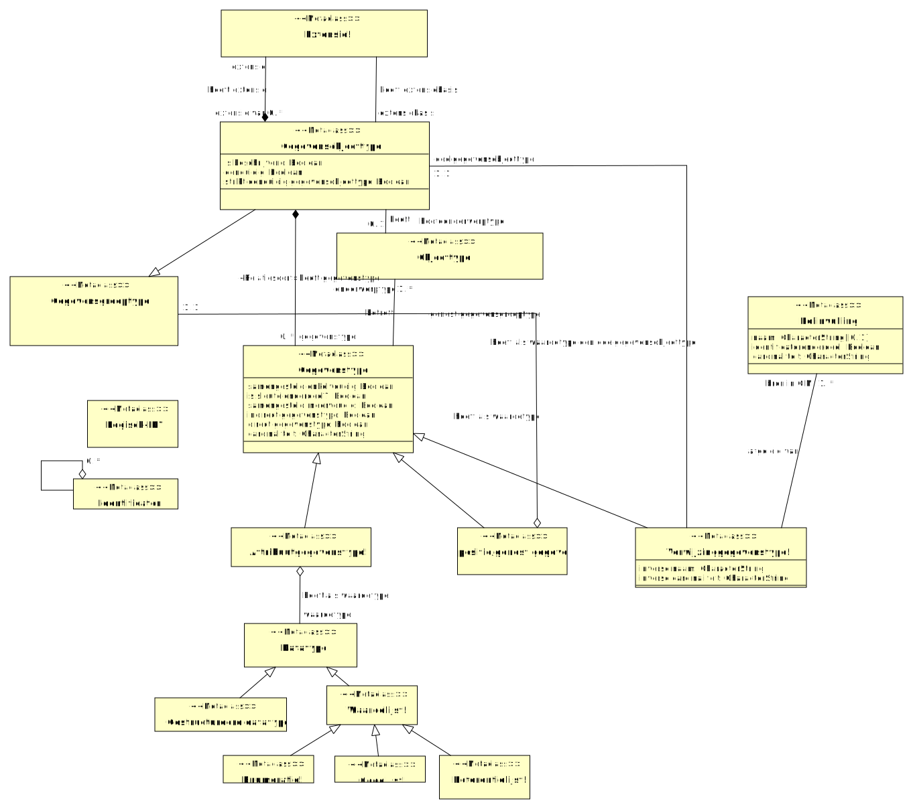

## Domein MIM-Metaklassen-LGM-Logisch

### LGM-LGM-MIM - detail

## Objecttypes en relatieklassen

### Attribuutgegevenstype! {#B85CF0D3-1EA4-4bc2-BEC1-8187A49D5824}

|{: .def}||
|-|-|
|Naam|Attribuutgegevenstype!|
|Indicatie abstract object|Nee|

|Relatie|Definitie
|-------|---------|
|[Attribuutgegevenstype!](#B85CF0D3-1EA4-4bc2-BEC1-8187A49D5824) heeft als waardetype waardetype [Datatype](#09E003D3-8AD7-474d-8291-F8C4C9C8AE90) []||
|[Attribuutgegevenstype!](#B85CF0D3-1EA4-4bc2-BEC1-8187A49D5824) is specialisatie van [Gegevenstype](#A73BCD29-D696-47b5-B247-1891B846CCD2)||

### Codelijst! {#EAA7F9B8-7A33-42fd-8CDE-0B576697598F}

|{: .def}||
|-|-|
|Naam|Codelijst!|
|Indicatie abstract object|Nee|

|Relatie|Definitie
|-------|---------|
|[Codelijst!](#EAA7F9B8-7A33-42fd-8CDE-0B576697598F) is specialisatie van [Waardelijst!](#6E318C51-642F-4f4d-957B-77C5D42021E1)||

### Compositie/genest gegevenstype! {#824B07CB-FC8C-4f57-8827-BD643CB3DA3D}

|{: .def}||
|-|-|
|Naam|Compositie/genest gegevenstype!|
|Indicatie abstract object|Nee|

|Relatie|Definitie
|-------|---------|
|[Compositie/genest gegevenstype!](#824B07CB-FC8C-4f57-8827-BD643CB3DA3D) heeft als waardetype genest gegevensgroeptype [Gegevensgroeptype](#A20B6FED-9D1A-4adb-8227-A722613AAFB7) [1..1]||
|[Compositie/genest gegevenstype!](#824B07CB-FC8C-4f57-8827-BD643CB3DA3D) is specialisatie van [Gegevenstype](#A73BCD29-D696-47b5-B247-1891B846CCD2)||

### Datatype {#09E003D3-8AD7-474d-8291-F8C4C9C8AE90}

Een datatype is een conditie waarbij van een kenmerk of waarde is gesteld wat voor datatype de waarde of invulling van dat kenmerk mag zijn.

|{: .def}||
|-|-|
|Naam|Datatype|
|Indicatie abstract object|Nee|
|Definitie|Een datatype is een conditie waarbij van een kenmerk of waarde is gesteld wat voor datatype de waarde of invulling van dat kenmerk mag zijn.|

|Relatie|Definitie
|-------|---------|
|[Waardelijst!](#6E318C51-642F-4f4d-957B-77C5D42021E1) is specialisatie van [Datatype](#09E003D3-8AD7-474d-8291-F8C4C9C8AE90)||
|[Gestructureerd datatype](#9E58E202-57E3-4cfa-8BAD-4A149125484C) is specialisatie van [Datatype](#09E003D3-8AD7-474d-8291-F8C4C9C8AE90)||
|[Attribuutgegevenstype!](#B85CF0D3-1EA4-4bc2-BEC1-8187A49D5824) heeft als waardetype waardetype [Datatype](#09E003D3-8AD7-474d-8291-F8C4C9C8AE90) []||

### Enumeratie! {#58BAE188-BCEB-4a00-BD16-6A49C237E078}

|{: .def}||
|-|-|
|Naam|Enumeratie!|
|Indicatie abstract object|Nee|

|Relatie|Definitie
|-------|---------|
|[Enumeratie!](#58BAE188-BCEB-4a00-BD16-6A49C237E078) is specialisatie van [Waardelijst!](#6E318C51-642F-4f4d-957B-77C5D42021E1)||

### Extensie! {#97409214-7B52-4a4e-B563-7A894919DE54}

|{: .def}||
|-|-|
|Naam|Extensie!|
|Indicatie abstract object|Nee|

|Relatie|Definitie
|-------|---------|
|[Gegevensobjecttype](#D0282BA4-C2F8-4d8c-BF2D-01844E161EEC) heeft extensie extensie [Extensie!](#97409214-7B52-4a4e-B563-7A894919DE54) []||
|[Extensie!](#97409214-7B52-4a4e-B563-7A894919DE54) is specialisatie van ||
|[Extensie!](#97409214-7B52-4a4e-B563-7A894919DE54) heeft extensiebasis extensiebasis [Gegevensobjecttype](#D0282BA4-C2F8-4d8c-BF2D-01844E161EEC) []||

### Gegevensgroeptype {#A20B6FED-9D1A-4adb-8227-A722613AAFB7}

Een gegevensgroeptype is een typering van gelijksoortige gegevensgroepen.

of uit uitleg:
Een gegevensgroeptype (of groeperend gegevensobjecttype) is een gegevensobjecttype zonder hoofdonderwerp

|{: .def}||
|-|-|
|Naam|Gegevensgroeptype|
|Indicatie abstract object|Nee|
|Definitie|Een gegevensgroeptype is een typering van gelijksoortige gegevensgroepen.
|

|Relatie|Definitie
|-------|---------|
|[Compositie/genest gegevenstype!](#824B07CB-FC8C-4f57-8827-BD643CB3DA3D) heeft als waardetype genest gegevensgroeptype [Gegevensgroeptype](#A20B6FED-9D1A-4adb-8227-A722613AAFB7) [1..1]||
|[Gegevensobjecttype](#D0282BA4-C2F8-4d8c-BF2D-01844E161EEC) is specialisatie van [Gegevensgroeptype](#A20B6FED-9D1A-4adb-8227-A722613AAFB7)||

### Gegevensobjecttype {#D0282BA4-C2F8-4d8c-BF2D-01844E161EEC}

Een GEGEVENSOBJECTTYPE is een typering van gelijksoortige GEGEVENSOBJECTen.

|{: .def}||
|-|-|
|Naam|Gegevensobjecttype|
|Indicatie abstract object|Nee|
|Definitie|Een GEGEVENSOBJECTTYPE is een typering van gelijksoortige GEGEVENSOBJECTen.|

|Attribuut|Definitie|Formaat|Card|
|---------|---------|-------|----|
|is beschrijvend|Een beschrijvend gegevensobjecttype is een gegevensobjecttype met precies één hoofdonderwerp, zonder dat de sleutel van het hoofdonderwerp bekend is
|[Boolean]()|1..1|
|eenduidig|Een eenduidig gegevensobjecttype is een gegevensobjecttype met precies één hoofdonderwerp waarvan de sleutel bekend is.
|[Boolean]()|1..1|
|strikt eenduidig gegevensobjecttype|Een strikt eenduidig gegevensobjecttype is een gegevensobjecttype over alleen eigenschappen van het hoofdonderwerp waarvan de sleutel bekend is.
|[Boolean]()|1..1|

|Relatie|Definitie
|-------|---------|
|[Gegevensobjecttype](#D0282BA4-C2F8-4d8c-BF2D-01844E161EEC) heeft extensie extensie [Extensie!](#97409214-7B52-4a4e-B563-7A894919DE54) []||
|[Gegevensobjecttype](#D0282BA4-C2F8-4d8c-BF2D-01844E161EEC) heeft gegevenstype gegevenstype [Gegevenstype](#A73BCD29-D696-47b5-B247-1891B846CCD2) [0..*]||
|[Gegevensobjecttype](#D0282BA4-C2F8-4d8c-BF2D-01844E161EEC) is specialisatie van ||
|[Gegevensobjecttype](#D0282BA4-C2F8-4d8c-BF2D-01844E161EEC) is specialisatie van [Gegevensgroeptype](#A20B6FED-9D1A-4adb-8227-A722613AAFB7)||
|[Verwijzinggegevenstype!](#7ADA30AB-7A47-4301-B3DD-F2A94917D8C4) heeft als waardetype een doelgegevensobjecttype doelgegevensobjecttype [Gegevensobjecttype](#D0282BA4-C2F8-4d8c-BF2D-01844E161EEC) [1..1]||
|[Gegevensobjecttype](#D0282BA4-C2F8-4d8c-BF2D-01844E161EEC) heeft hoofdonderwerptype [Objecttype](#A80A4669-D70D-42cd-9E1D-856E1DFF20F6) [0..1]||
|[Extensie!](#97409214-7B52-4a4e-B563-7A894919DE54) heeft extensiebasis extensiebasis [Gegevensobjecttype](#D0282BA4-C2F8-4d8c-BF2D-01844E161EEC) []||

### Gegevenstype {#A73BCD29-D696-47b5-B247-1891B846CCD2}

Een GEGEVENSTYPE is een typering van gelijksoortige GEGEVENs.

|{: .def}||
|-|-|
|Definitie|Een GEGEVENSTYPE is een typering van gelijksoortige GEGEVENs.|
|Naam|Gegevenstype|
|Indicatie abstract object|Ja|

|Attribuut|Definitie|Formaat|Card|
|---------|---------|-------|----|
|samengesteld enkelvoudig|Een samengesteld enkelvoudig gegevenstype is een gegevenstype over één kenmerk van meerdere domeinobjecten.
|[Boolean]()|1..1|
|is sleutelonderdeel?|Een sleutelonderdeel  is onderdeel van een groep van één of meer gegevenstypen waarmee een unieke aanduiding voor het hoofdonderwerp van een gegevensobject kan worden gevormd.|[Boolean]()|1..1|
|samengesteld meervoudig|Een samengesteld meervoudig gegevenstype is een gegevenstype over meerdere eigenschappen van één of meerdere domeinobjecten.
|[Boolean]()|1..1|
|indirect gegevenstype|Een indirect gegevenstype is een gegevenstype over één kenmerk van een domeinobject, vastgelegd bij een gegevensobjecttype dat dit domeinobject niet als hoofdonderwerp heeft
|[Boolean]()|1..1|
|direct gegevenstype|Een direct gegevenstype is een gegevenstype over één eigenschap van een domeinobject, vastgelegd bij een gegevensobjectype dat dit domeinobject als hoofdonderwerp heeft.
|[Boolean]()|1..1|
|cardinaliteit||[CharacterString]()|1..1|

|Relatie|Definitie
|-------|---------|
|[Gegevensobjecttype](#D0282BA4-C2F8-4d8c-BF2D-01844E161EEC) heeft gegevenstype gegevenstype [Gegevenstype](#A73BCD29-D696-47b5-B247-1891B846CCD2) [0..*]||
|[Gegevenstype](#A73BCD29-D696-47b5-B247-1891B846CCD2) betreft onderwerptype [Objecttype](#A80A4669-D70D-42cd-9E1D-856E1DFF20F6) [1..*]||
|[Gegevenstype](#A73BCD29-D696-47b5-B247-1891B846CCD2) is specialisatie van ||
|[Compositie/genest gegevenstype!](#824B07CB-FC8C-4f57-8827-BD643CB3DA3D) is specialisatie van [Gegevenstype](#A73BCD29-D696-47b5-B247-1891B846CCD2)||
|[Verwijzinggegevenstype!](#7ADA30AB-7A47-4301-B3DD-F2A94917D8C4) is specialisatie van [Gegevenstype](#A73BCD29-D696-47b5-B247-1891B846CCD2)||
|[Attribuutgegevenstype!](#B85CF0D3-1EA4-4bc2-BEC1-8187A49D5824) is specialisatie van [Gegevenstype](#A73BCD29-D696-47b5-B247-1891B846CCD2)||

### Gestructureerd datatype {#9E58E202-57E3-4cfa-8BAD-4A149125484C}

|{: .def}||
|-|-|
|Naam|Gestructureerd datatype|
|Indicatie abstract object|Nee|

|Relatie|Definitie
|-------|---------|
|[Gestructureerd datatype](#9E58E202-57E3-4cfa-8BAD-4A149125484C) is specialisatie van [Datatype](#09E003D3-8AD7-474d-8291-F8C4C9C8AE90)||

### Identificator {#B8194110-F0D6-4391-9D81-11EB1AD611A1}

Een identificator is een geheel van één of meerdere [identificerende kenmerken] waarmee de identiteit van een [domeinobject] uniek kan worden vastgesteld

|{: .def}||
|-|-|
|Definitie|Een identificator is een geheel van één of meerdere [identificerende kenmerken] waarmee de identiteit van een [domeinobject] uniek kan worden vastgesteld|
|Herkomst||
|Begrip||
|TODO: alias||
|Indicatie abstract object|Nee|
|Herkomst definitie||
|Datum opname||
|Naam|Identificator|

|Relatie|Definitie
|-------|---------|
|[Identificator](#B8194110-F0D6-4391-9D81-11EB1AD611A1)   [Identificator](#B8194110-F0D6-4391-9D81-11EB1AD611A1) [0..*]||

### Logisch-ID? {#164B52BC-D0BB-4a1c-AC05-D09540F737B8}

|{: .def}||
|-|-|
|Naam|Logisch-ID?|
|Indicatie abstract object|Nee|

### Referentielijst! {#75374898-4AFB-4c0f-AE28-25599EAF59F3}

|{: .def}||
|-|-|
|Naam|Referentielijst!|
|Indicatie abstract object|Nee|

|Relatie|Definitie
|-------|---------|
|[Referentielijst!](#75374898-4AFB-4c0f-AE28-25599EAF59F3) is specialisatie van [Waardelijst!](#6E318C51-642F-4f4d-957B-77C5D42021E1)||

### Verwijzinggegevenstype! {#7ADA30AB-7A47-4301-B3DD-F2A94917D8C4}

|{: .def}||
|-|-|
|Naam|Verwijzinggegevenstype!|
|Indicatie abstract object|Nee|

|Attribuut|Definitie|Formaat|Card|
|---------|---------|-------|----|
|inverse naam||[CharacterString]()|1..1|
|inverse cardinaliteit||[CharacterString]()|1..1|

|Relatie|Definitie
|-------|---------|
|[Verwijzinggegevenstype!](#7ADA30AB-7A47-4301-B3DD-F2A94917D8C4) afgeleid van bron in CIM [Rolinvulling](#C11E0907-9B14-4123-9A26-4F54539FBFEB) [1..*]||
|[Verwijzinggegevenstype!](#7ADA30AB-7A47-4301-B3DD-F2A94917D8C4) is specialisatie van [Gegevenstype](#A73BCD29-D696-47b5-B247-1891B846CCD2)||
|[Verwijzinggegevenstype!](#7ADA30AB-7A47-4301-B3DD-F2A94917D8C4) heeft als waardetype een doelgegevensobjecttype doelgegevensobjecttype [Gegevensobjecttype](#D0282BA4-C2F8-4d8c-BF2D-01844E161EEC) [1..1]||

### Waardelijst! {#6E318C51-642F-4f4d-957B-77C5D42021E1}

|{: .def}||
|-|-|
|Naam|Waardelijst!|
|Indicatie abstract object|Nee|

|Relatie|Definitie
|-------|---------|
|[Waardelijst!](#6E318C51-642F-4f4d-957B-77C5D42021E1) is specialisatie van [Datatype](#09E003D3-8AD7-474d-8291-F8C4C9C8AE90)||
|[Codelijst!](#EAA7F9B8-7A33-42fd-8CDE-0B576697598F) is specialisatie van [Waardelijst!](#6E318C51-642F-4f4d-957B-77C5D42021E1)||
|[Enumeratie!](#58BAE188-BCEB-4a00-BD16-6A49C237E078) is specialisatie van [Waardelijst!](#6E318C51-642F-4f4d-957B-77C5D42021E1)||
|[Referentielijst!](#75374898-4AFB-4c0f-AE28-25599EAF59F3) is specialisatie van [Waardelijst!](#6E318C51-642F-4f4d-957B-77C5D42021E1)||
